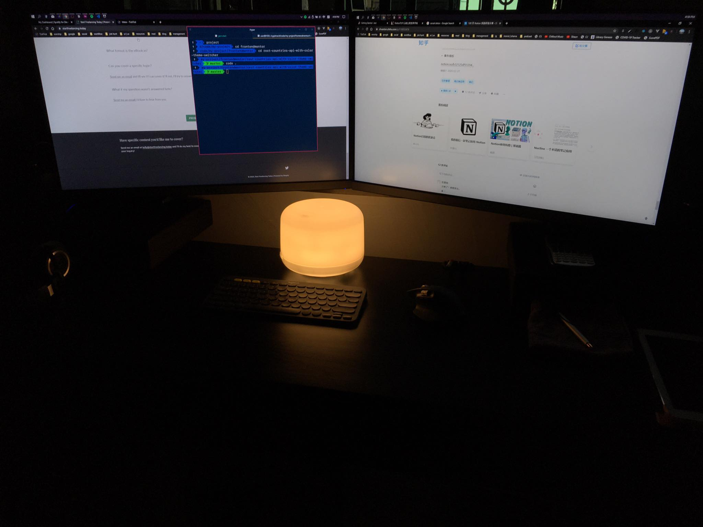

As you can see from the post title, I'm going to stop using social media for a month. I've tried to do something similar but never really stop using them. As far as I can think of, I am **most active** on Instagram, Twitter and Facebook. I have cut off my time checking out them starting from today.

WhatsApp, Messenger or WeChat **will be excluded** as they serve me as my messaging tools, I still need them to contact my family and friends.

---

## What is the rule?

The rule is simple. **Don't visit** any aforementioned social media platforms, not on the laptop, tablet or mobile phone, everything.

Previously I've tried some advices from [Digital Minimalism](https://www.amazon.com/Digital-Minimalism-Choosing-Focused-Noisy/dp/0525536515). I deleted all the app from my iPhone and iPad, but you know what. I still reserved the bookmarks for me to access them easily on the web. I need to make it harder for me to reach them now. So I logged out from all of the accounts and something has changed. I know I am serious this time. I'm curious to see how much will change within this 30 days.

## What to do after 30 days?

Short answer: I don't know.

Long answer: Who knows what will happen in the future, right? I guess, I might continue living without them or I might slip into the holes once again. No matter what, I am determined to come out stronger and better. I want to build a healthy relationship with technologies. Balance is everything.

## What have I done on the first day?

Reorganize my productivity system. I pick out bullet journal again and turn it into a combination of GoodNotes5 & Notion. Since Notion announced they made the personal plan free for unlimited blocks recently, I am so excited to be able to use it again without limitation! I like to review my system every now and then, that way I can improve my productivity from time to time.

## Additional rule

I put my phone & tablet in my study room before I go to my bedroom upstairs. I have been doing this for 2 months or so. However, for the past week I started to bring my tablet along with me, for consuming some reading materials. This is a really bad idea because it is affecting my sleeping schedule as I don't know where to stop. Damn it.

Starting from today, no electronic device is allowed before sleeping. Instead I could try to read physical book. This sounds better. Maybe I should consider buying a Kindle in the future as I have more e-books now.

But then how do I wake myself up? I will be using my Amazfit watch as my alarms. 😁

## Final thought

Everyone has their own methods to overcome their problems successfully and efficiently. I am still exploring and experimenting.

> Every single day is a chance for change.

---

**My desk, my rules.**

